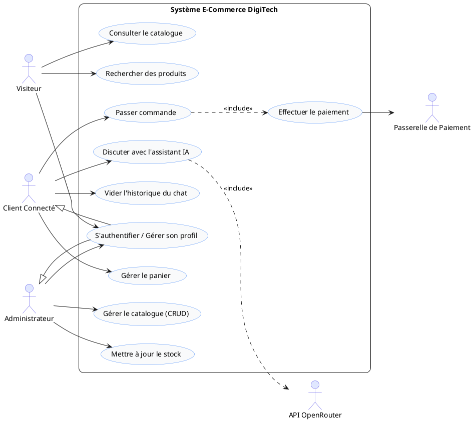
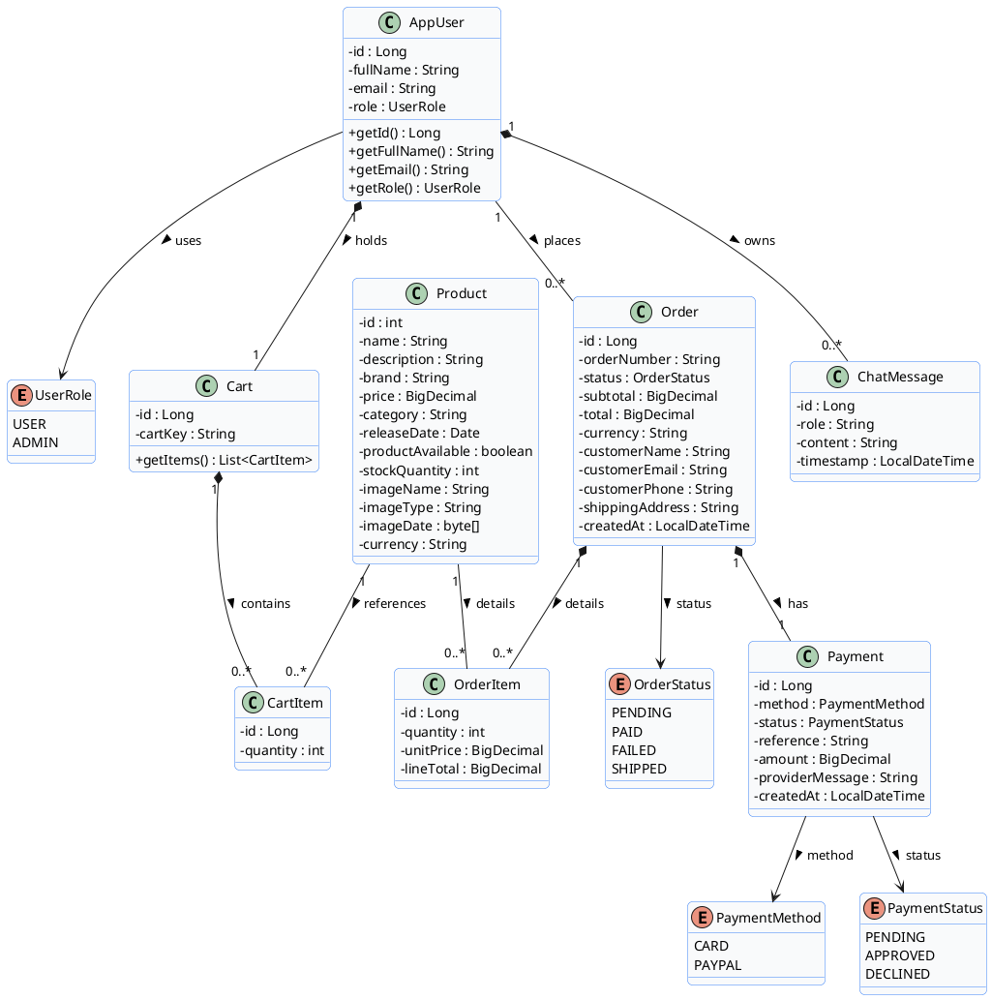
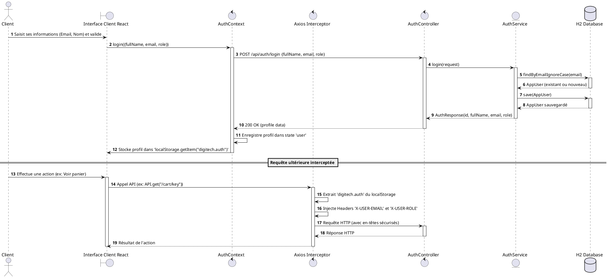
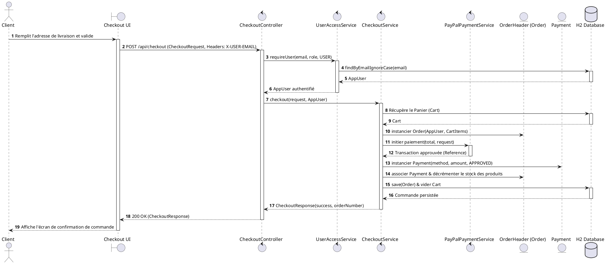
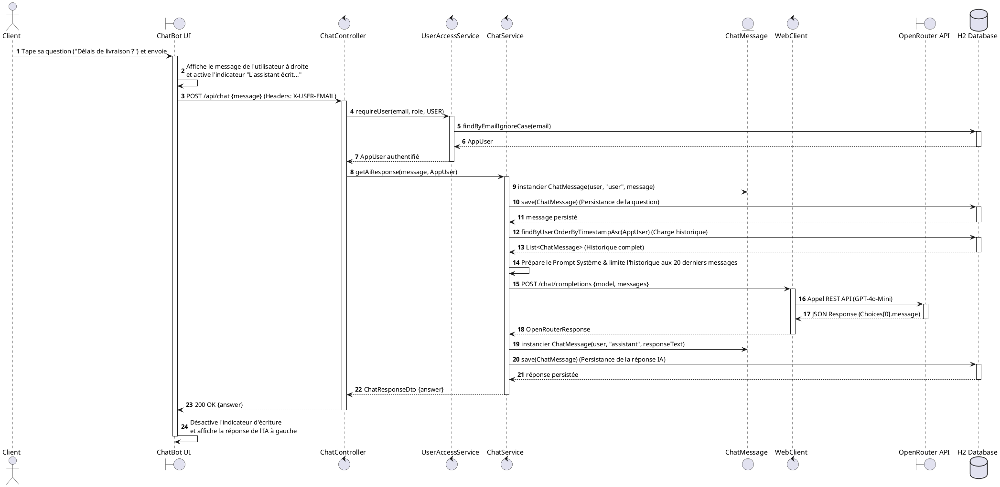

# Chapitre 4 : Analyse et Conception UML Académique

Ce document constitue la section **« Analyse et Conception »** rédigée dans un style universitaire rigoureux, adaptée à un mémoire ou rapport de projet de fin d'études (PFE). Elle est basée sur une analyse complète et exacte de l'architecture réelle de votre application (Backend Spring Boot et Frontend React).

---

## 4.1 Analyse des besoins

L'analyse des besoins constitue une étape fondamentale permettant d'établir une frontière nette entre les attentes métiers des utilisateurs (ce que le système doit faire) et les contraintes techniques du système (comment il doit le faire).

### 4.1.1 Besoins fonctionnels
Les besoins fonctionnels décrivent les actions et services que l'application DigiTech doit fournir à ses utilisateurs. Ils sont structurés autour de quatre axes majeurs :

1.  **Gestion du Catalogue et de la Recherche** :
    *   Le système doit permettre la consultation des produits par le public (utilisateurs anonymes et connectés).
    *   La recherche multicritère (par mots-clés, catégories ou marques) doit être disponible de manière fluide.
    *   L'administrateur doit disposer d'un accès privilégié pour ajouter, modifier ou supprimer des produits du catalogue.
2.  **Gestion du Panier et Processus d'Achat** :
    *   L'utilisateur doit pouvoir ajouter, mettre à jour la quantité ou retirer des articles de son panier.
    *   Le panier doit être persistant durant la navigation active du client.
    *   La validation du panier (Checkout) doit collecter les coordonnées de livraison et calculer automatiquement les sous-totaux et taxes.
3.  **Gestion des Commandes et des Paiements** :
    *   Le système doit permettre au client d'effectuer des transactions bancaires sécurisées via des simulateurs de cartes de crédit ou PayPal.
    *   En cas d'approbation bancaire, le système doit créer une commande, décrémenter le stock physique des produits et vider le panier.
    *   L'utilisateur doit pouvoir consulter son historique de commandes.
4.  **Assistance Client par Chatbot IA** :
    *   Le client connecté doit disposer d'une fenêtre de discussion flottante accessible de manière globale.
    *   L'assistant virtuel doit répondre de façon contextualisée en français et conserver l'historique complet de la conversation.
    *   L'utilisateur doit avoir la possibilité de réinitialiser et purger son historique de discussion.

### 4.1.2 Besoins non fonctionnels
Les besoins non fonctionnels définissent les critères de qualité, de performance et de sécurité du système :

*   **Sécurité et Confidentialité** : Authentification rigoureuse des clients. Toutes les requêtes vers les endpoints sensibles (`/api/chat`, `/api/checkout`, etc.) doivent faire l'objet d'un contrôle d'habilitation strict basé sur les privilèges utilisateurs.
*   **Performance et Scalabilité** : Les temps de réponse de l'assistant conversationnel doivent être minimisés (cible inférieure à 1.5 seconde par message) en exploitant des requêtes HTTP asynchrones performantes (WebClient) et en limitant la taille de l'historique de contexte.
*   **Ergonomie et Fluidité** : L'interface utilisateur (UI/UX) doit offrir une expérience premium moderne (effet verre dépoli glassmorphism, animations fluides d'apparition des messages et de saisie en temps réel).
*   **Disponibilité et Portabilité** : L'application doit être pleinement *responsive*, s'adaptant automatiquement aux formats mobiles (smartphones, tablettes) sans perte de fonctionnalités.

---

## 4.2 Identification des acteurs

Un acteur représente un rôle joué par une personne ou un système externe qui interagit directement avec l'application DigiTech. Nous identifions cinq acteurs principaux :

1.  **Visiteur** : Utilisateur anonyme qui parcourt le site e-commerce, consulte le catalogue de produits et effectue des recherches. Il n'a aucun droit d'écriture (panier, commandes, chatbot).
2.  **Client Connecté** : Utilisateur authentifié disposant d'un compte actif. Il possède tous les droits d'achat (panier, validation de commande, paiement) et d'accès au chatbot IA personnalisé (discussion, purge d'historique).
3.  **Administrateur** : Utilisateur interne disposant de privilèges élevés. Il est responsable de la gestion du catalogue (opérations CRUD sur les produits, gestion des stocks) et du suivi des ventes.
4.  **Passerelle de Paiement** : Système externe (ex : API PayPal ou processeur de carte bancaire) chargé de valider ou de décliner la transaction financière au moment du checkout.
5.  **API OpenRouter (GPT-4o-Mini)** : Système d'intelligence artificielle externe qui reçoit le contexte et l'historique de discussion pour renvoyer la réponse textuelle de l'assistant virtuel.

---

## 4.3 Diagramme de cas d'utilisation

Le diagramme de cas d'utilisation formalise les interactions entre les acteurs identifiés et les grandes fonctionnalités du système.

### Description détaillée des cas d'utilisation clés :
*   **Discuter avec l'assistant IA** : Réservé au *Client Connecté*. Permet d'envoyer des messages en langage naturel à un assistant intelligent. Ce cas d'utilisation inclut de manière obligatoire (`<<include>>`) la transmission de l'historique à l'**API OpenRouter** pour obtenir une réponse contextualisée.
*   **Passer commande** : Le client valide son panier actif. Cette fonctionnalité inclut obligatoirement (`<<include>>`) le traitement du paiement qui fait intervenir la **Passerelle de Paiement** externe.
*   **Gérer le catalogue (CRUD)** : Privilège de l'*Administrateur* lui permettant de maintenir à jour le référentiel des articles.

---

## 4.4 Diagramme de classes

Le diagramme de classes structurel représente la vue statique des données au sein du backend Spring Boot. Il découle directement des entités JPA réelles et de leurs relations d'association.

### Explication détaillée des classes et relations :

1.  **Relation AppUser et ChatMessage (`1` vers `0..*`)** :
    *   **Description** : Relation de composition forte. Un utilisateur (`AppUser`) possède zéro, un ou plusieurs messages de discussion (`ChatMessage`).
    *   **Cardinalités** : Un message appartient obligatoirement à un et un seul utilisateur. Si l'utilisateur est supprimé, l'historique associé est intégralement purgé en cascade (intégrité référentielle).
2.  **Relation AppUser et Cart (`1` vers `1`)** :
    *   **Description** : Chaque utilisateur authentifié est rattaché à son propre panier persistant (`Cart`), identifié de manière unique via une clé d'accès (`cartKey`).
3.  **Panier et Articles (`Cart`, `CartItem`, `Product`)** :
    *   `Cart` est composé de `CartItem` (`1` vers `0..*`).
    *   `CartItem` fait référence à un unique `Product`. Cette structure permet d'isoler la quantité sélectionnée par le client sans modifier les attributs intrinsèques du produit.
4.  **Relation Commande et Détails (`Order`, `OrderItem`, `Payment`)** :
    *   Une commande (`Order`) représente l'en-tête de facturation (adresse, totaux, date).
    *   Elle englobe une collection de lignes de détails (`OrderItem`) dans une relation de composition `1` vers `0..*`. Chaque ligne fige le prix unitaire d'achat (`unitPrice`) à la date de validation, protégeant l'historique des fluctuations futures de prix du produit.
    *   Une commande est associée de manière stricte à une unique transaction financière (`Payment`) dans une relation `1` vers `1`.

---

## 4.5 Diagramme de séquence 1 : Authentification et Interception de Session

### Description du scénario
Ce diagramme illustre le processus de connexion de l'utilisateur et le mécanisme d'authentification asynchrone simulé côté client par Axios. Le client saisit ses identifiants. Une fois validés, le profil est stocké dans le `localStorage` de React. Les appels d'API ultérieurs vers le backend sont interceptés afin d'y injecter automatiquement les en-têtes d'autorisation sécurisés.

### Préconditions
*   Le client est sur la page de connexion.
*   L'adresse e-mail saisie est syntaxiquement correcte.

### Postconditions
*   Le profil de l'utilisateur est persisté ou mis à jour dans la base H2.
*   La session utilisateur est active localement dans le state de l'application et persistée dans le stockage local du navigateur.
*   L'intercepteur de requêtes d'Axios est configuré pour propager automatiquement les en-têtes.

### Explication détaillée étape par étape :
1.  **Validation locale (Étapes 1-2)** : L'utilisateur valide le formulaire en front. L'action appelle le service d'authentification global de React (`AuthContext`).
2.  **Appel REST (Étapes 3-4)** : Une requête POST asynchrone est émise vers `/api/auth/login`.
3.  **Persistance Backend (Étapes 5-8)** : Le `AuthService` recherche l'utilisateur en base. S'il n'existe pas, un nouvel `AppUser` est créé et persisté avec le rôle assigné par défaut (`USER`).
4.  **Stockage de Session (Étapes 9-11)** : La réponse HTTP 200 OK déclenche le stockage du profil en local dans React et le navigateur (`localStorage`).
5.  **Interception (Étapes 12-18)** : Pour toute action ultérieure nécessitant une communication avec le serveur (ex: charger le panier), le composant fait appel à l'instance configurée d'Axios. L'intercepteur analyse à la volée le stockage local, extrait l'adresse e-mail et le rôle, et les injecte dans les en-têtes personnalisés de la requête HTTP sortante. Le serveur Spring Boot est ainsi capable de valider l'identité de l'émetteur sans nécessiter de sessions HTTP côté serveur (principe de l'architecture REST Stateless).

---

## 4.6 Diagramme de séquence 2 : Processus de Commande et de Paiement

### Description du scénario
Ce diagramme retrace le flux de validation d'achat. Le client initie la validation de son panier (Checkout). Le système authentifie le client via les en-têtes, instancie la commande, lance la transaction financière simulée avec le processeur externe, met à jour les stocks de produits et persiste la commande finalisée en base de données avant de réinitialiser le panier.

### Préconditions
*   L'utilisateur est authentifié.
*   Le panier contient au moins un produit.
*   Les produits dans le panier sont en stock dans la quantité demandée.

### Postconditions
*   Une entité `Order` est créée à l'état `PAID`.
*   Une entité `Payment` associée est persistée à l'état `APPROVED`.
*   Le panier actif de l'utilisateur est vidé.
*   Le stock physique des produits concernés est mis à jour.

### Explication détaillée étape par étape :
1.  **Habilitation (Étapes 1-6)** : La requête de validation de commande atteint le `CheckoutController` qui interroge immédiatement `UserAccessService` pour s'assurer de l'identité et de la validité du client connecté.
2.  **Traitement Métier (Étapes 7-10)** : Le `CheckoutService` récupère la structure active du panier (`Cart`) depuis la base de données pour éviter toute fraude sur le montant total calculé. Il instancie ensuite l'objet d'en-tête de commande `Order`.
3.  **Paiement Externe (Étapes 11-12)** : Le service de paiement injecte les coordonnées de facturation et sollicite le processeur bancaire (ici simulé par le service de paiement PayPal). Ce dernier renvoie une référence unique de transaction après validation.
4.  **Enregistrement (Étapes 13-16)** : Le système associe la transaction approuvée à la commande, décrémente de manière atomique la quantité disponible en stock dans chaque fiche `Product` et purge les articles du panier. Enfin, la commande globale est enregistrée en base H2.
5.  **Restitution (Étapes 17-19)** : La réponse finale contenant le numéro de commande unique (ex: `DG-SEED-0001`) est retransmise au client pour affichage à l'écran.

---

## 4.7 Diagramme de séquence 3 : Assistant Conversationnel (Chatbot IA)

### Description du scénario
Ce diagramme détaille le flux d'échange asynchrone avec l'assistant virtuel. Le client envoie une question. Le backend authentifie l'expéditeur, persiste la question pour maintenir un historique, charge les échanges passés, formule la requête pour l'API OpenRouter, intercepte la réponse du modèle GPT-4o-Mini, la sauvegarde, et la retransmet au client.

### Préconditions
*   L'utilisateur est authentifié et connecté.
*   L'application backend dispose d'une clé API OpenRouter valide.

### Postconditions
*   La question du client et la réponse de l'assistant sont enregistrées en base H2 sous forme d'entités `ChatMessage` associées à l'utilisateur.
*   La réponse s'affiche à l'écran de manière asynchrone.

### Explication détaillée étape par étape :
1.  **Réactivité UI (Étapes 1-2)** : Dès le clic sur "Envoyer", le client React affiche instantanément la bulle à droite et lance une animation de points de suspension ("L'assistant écrit..."). Le bouton de soumission est désactivé pour empêcher l'envoi de requêtes concurrentes.
2.  **Validation HTTP (Étapes 3-7)** : La question est postée à `/api/chat` avec les en-têtes d'identification du client. Le contrôleur s'assure de sa validité.
3.  **Persistance de la question (Étapes 8-10)** : Le service instancie un `ChatMessage` marqué du rôle `user` et le stocke en base de données.
4.  **Assemblage du contexte (Étapes 11-13)** : Le système charge l'historique complet de l'utilisateur ordonné par date. Il tronque les anciens échanges pour ne conserver que les 20 derniers messages (préservation des performances et maîtrise des coûts). Il y adjoint le message de directive système (guidant le ton de l'assistant e-commerce).
5.  **Requête API REST (Étapes 14-17)** : Le composant WebClient émet une requête POST synchrone et bloquante vers OpenRouter.
6.  **Persistance de la réponse IA (Étapes 18-20)** : Le texte retourné par le LLM (GPT-4o-mini) est encapsulé dans une nouvelle entité `ChatMessage` de rôle `assistant` et sauvegardé en base de données.
7.  **Affichage final (Étapes 21-23)** : La réponse 200 OK est transmise au frontend. Le composant React désactive l'état d'attente, affiche la réponse à gauche, et effectue un défilement vertical fluide (*scroll auto*) pour assurer la visibilité de la réponse.

---

## 4.8 Justification des choix de conception

La modélisation et l'architecture retenues pour le projet DigiTech répondent à plusieurs critères d'ingénierie logicielle avancés :

### 1. Architecture découplée REST (Stateless)
L'utilisation d'une séparation claire entre le frontend (React) et le backend (Spring Boot) via des protocoles REST permet de rendre l'application performante et évolutive. Le fait que le backend n'ait pas à gérer de session d'état (Stateless) facilite l'authentification basée sur les en-têtes sécurisés, garantissant une intégration simple, propre et performante.

### 2. Choix de WebClient (Spring WebFlux) face à RestTemplate
Bien que l'architecture globale soit basée sur Spring Web MVC standard (synchrone), nous avons introduit le client réactif `WebClient` pour toutes nos communications avec l'API OpenRouter. Ce choix technique est motivé par la flexibilité et les performances accrues de `WebClient` par rapport au traditionnel `RestTemplate` (qui est aujourd'hui déprécié par Spring). `WebClient` permet de gérer très simplement les délais d'attente (timeouts) et les traitements d'erreur réseau de manière fluide.

### 3. Persistance Hybride de la Session du Chatbot
Pour offrir une expérience utilisateur premium, nous avons choisi de conserver l'historique de discussion à la fois dans l'état de l'application React (pour des transitions d'affichage ultra-rapides et sans rechargement) et dans la base de données H2 via l'entité JPA `ChatMessage`. Ce choix hybride garantit que si l'utilisateur actualise son navigateur, change de page ou se reconnecte sur un autre support, son historique conversationnel est fidèlement restauré.

---

## 4.9 Conclusion

Ce chapitre d'analyse et de conception UML a permis de jeter des bases structurelles solides pour la plateforme DigiTech. À travers une modélisation rigoureuse en cas d'utilisation, classes et séquences, nous avons pu valider l'intégrité fonctionnelle et technique du système. La modélisation de l'architecture du chatbot IA illustre la robustesse de l'intégration d'OpenRouter, tout en respectant scrupuleusement les contraintes de performance, de sécurité et d'ergonomie indispensables à tout projet de fin d'études universitaire en ingénierie logicielle.
